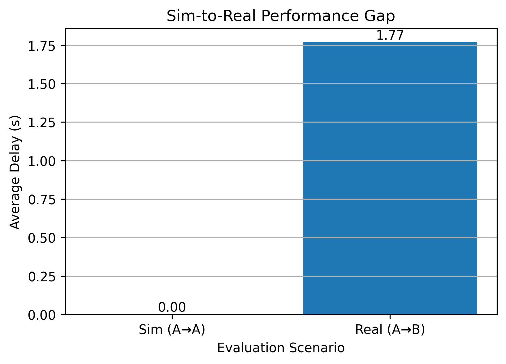
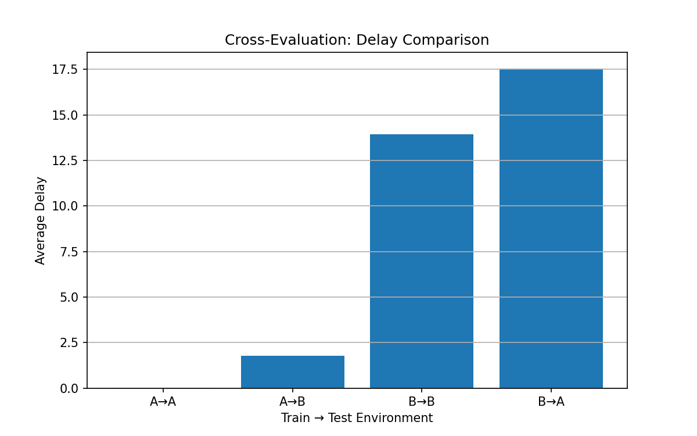
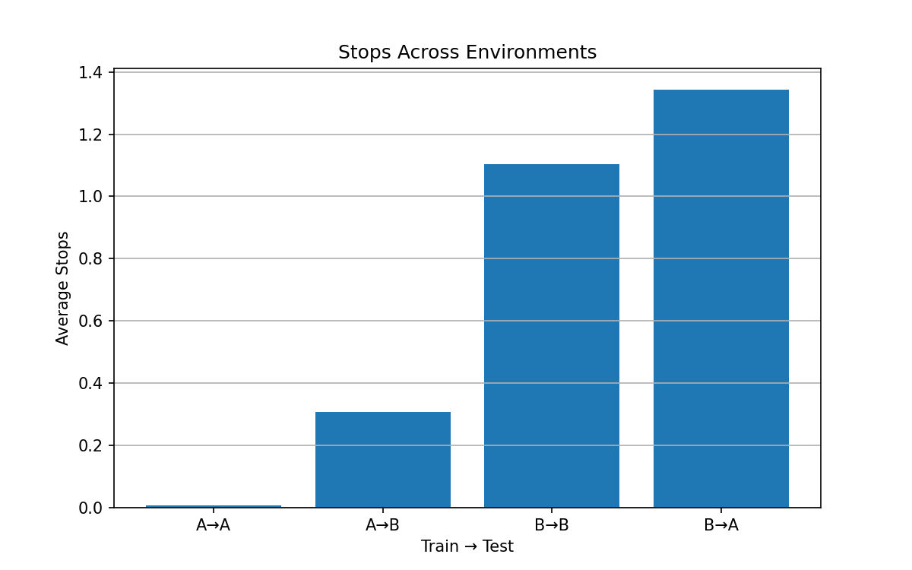
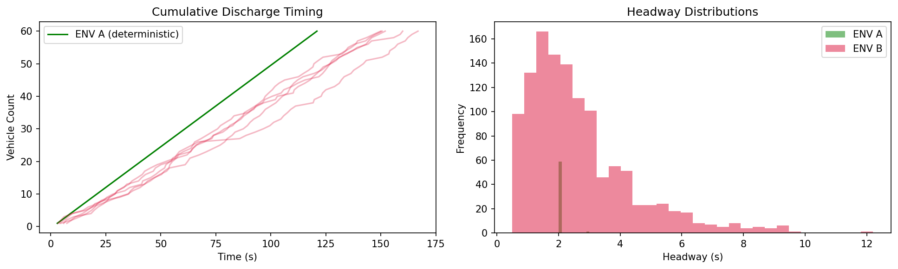

# 🚦 Sim-to-Real Gap in RL for Traffic Signal Control

> ⚠️ **Key Finding:** RL policies trained in idealized traffic simulations fail dramatically when deployed under realistic queue discharge dynamics.

---

## 🧠 Overview

This project investigates the **sim-to-real transfer problem** in reinforcement learning (RL) for traffic signal control.

While many RL approaches assume simplified traffic conditions, real-world traffic exhibits:
- stochastic headways  
- variable startup delays  
- non-linear queue discharge  

This mismatch leads to **severe performance degradation** when deploying trained policies.

---

## 🎯 Research Questions

- Do RL policies trained in idealized environments generalize to realistic traffic conditions?
- How does environment mismatch affect policy performance?

---

## 🧪 Methodology

Two simulation environments were built using SUMO:

### 🟢 ENV A — Idealized
- Constant headway (2.0 s)
- Fixed startup delay
- Deterministic discharge

### 🔴 ENV B — Realistic (Data-Calibrated)
- Lognormal headway distribution  
- Stochastic startup delay  
- Calibrated using real intersection behavior  

---

## 🤖 RL Setup

- Algorithm: Deep Q-Network (DQN)
- State: lane-level traffic features
- Action: signal phase selection

Two agents were trained:
- **Agent A** → trained in ENV A  
- **Agent B** → trained in ENV B  

---

## 🔁 Cross-Evaluation Results

| Scenario | Description | Delay (s) |
|--------|------------|----------|
| A → A | Ideal → Ideal (baseline) | ~0.0016 |
| A → B | Ideal → Real (sim-to-real gap) | ~1.77 |
| B → B | Real → Real (oracle) | ~13.93 |
| B → A | Real → Ideal (reverse transfer) | ~17.55 |

---

## 📊 Key Insight

- **~1000× increase in delay** when transferring from ideal to realistic environment  
- Realistic traffic dynamics significantly increase:
  - delay  
  - stops  
  - variability  

👉 The issue is not RL failure — it is **environment mismatch**

---

## 📈 Visual Results

### Sim-to-Real Gap

### Cross-Evaluation Delay

### Stops Comparison

### Traffic Dynamics (Headway + Discharge)

---

## 📁 Project Structure
models/ → trained RL agents
figures/ → plots used in analysis
results/ → evaluation outputs
notebook/ → full pipeline

---

## 🛠️ Tech Stack

- Python  
- PyTorch (DQN)  
- SUMO (traffic simulation)  
- TraCI API  
- NumPy, Pandas, Matplotlib  

---

## 🚀 Contribution

This work demonstrates that:

> Training RL models in simplified environments leads to poor real-world generalization.

It highlights the need for:
- realistic simulation environments  
- data-driven calibration  
- sim-to-real robustness in transportation AI  

---

## 👤 Author

**Jay Kumar Bagaria**  
MSc Infrastructure Engineering  
Transportation Systems  

---

## 📌 Future Work

- Multi-intersection control  
- Transfer learning / domain adaptation  
- Robust RL under uncertainty  
- Real-world deployment  

---
